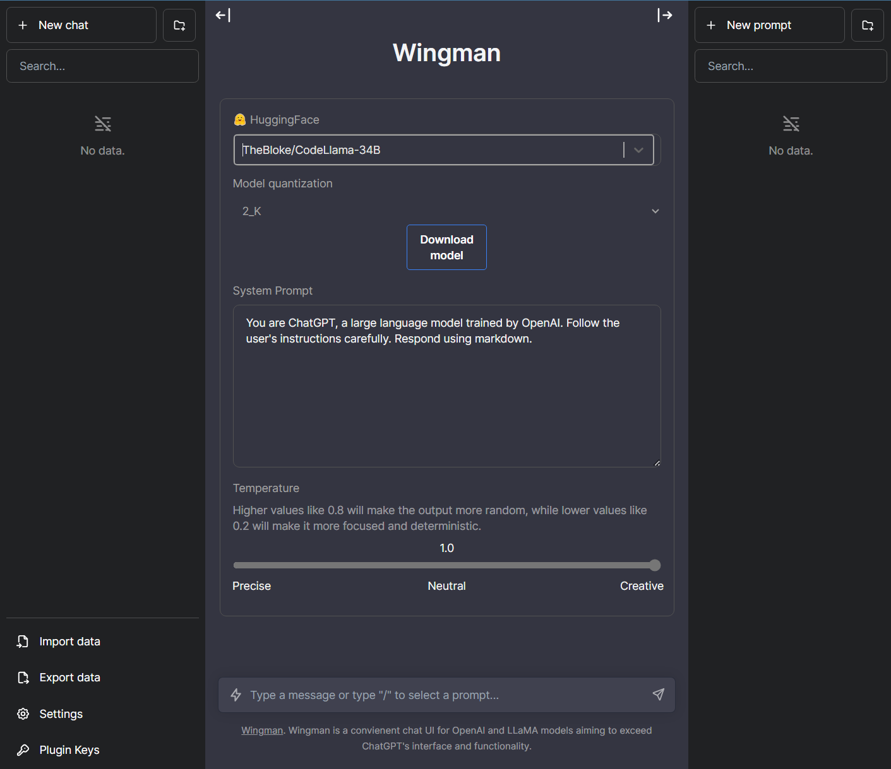

# Overview

Forked and modified from https://github.com/mckaywrigley/chatbot-ui

Wingman is an open source interface for AI models.



## Updates

Wingman will be updated over time. Expect frequent improvements.

**Next up:**

- [X] Add GPT-3.5 Turbo 16K
- [X] Duplicate existing conversations
- [ ] ⏳ Add local Llama support (in progress)
- [ ] ⏳ Download Llama models locally (in progress)
- [ ] Change AI model on the fly
- [ ] Extend conversation beyond original context

## Deploy

**Vercel**

Host your own live version of Wingman with Vercel.

[](https://vercel.com/new/clone?repository-url=https%3A%2F%2Fgithub.com%2Fcurtisgray%2Fbot)

**Docker**

Build locally:

```shell
docker build -t wingman .
docker run -e OPENAI_API_KEY=xxxxxxxx -p 3000:3000 wingman
```

Pull from Docker Hub:

```
docker run -e OPENAI_API_KEY=xxxxxxxx -p 3000:3000 carverlab/public-cloud:wingman
```

## Running Locally

**1. Clone Repo**

```bash
git clone https://github.com/curtisgray/wingman.git
```

**2. Install Dependencies**

```bash
npm i
```

**3. Provide OpenAI API Key**

Create a .env.local file in the root of the repo with your OpenAI API Key:

```bash
OPENAI_API_KEY=YOUR_KEY
```

> You can set `OPENAI_API_HOST` where access to the official OpenAI host is restricted or unavailable, allowing users to configure an alternative host for their specific needs.

> Additionally, if you have multiple OpenAI Organizations, you can set `OPENAI_ORGANIZATION` to specify one.

**4. Run App**

```bash
npm run dev
```

**5. Use It**

You should be able to start chatting.

## Configuration

When deploying the application, the following environment variables can be set:

| Environment Variable              | Default value                  | Description                                                                                                                               |
| --------------------------------- | ------------------------------ | ----------------------------------------------------------------------------------------------------------------------------------------- |
| OPENAI_API_KEY                    |                                | The default API key used for authentication with OpenAI                                                                                   |
| OPENAI_API_HOST                   | `https://api.openai.com`       | The base url, for Azure use `https://<endpoint>.openai.azure.com`                                                                         |
| OPENAI_API_TYPE                   | `openai`                       | The API type, options are `openai` or `azure`                                                                                             |
| OPENAI_API_VERSION                | `2023-03-15-preview`           | Only applicable for Azure OpenAI                                                                                                          |
| AZURE_DEPLOYMENT_ID               |                                | Needed when Azure OpenAI, Ref [Azure OpenAI API](https://learn.microsoft.com/zh-cn/azure/cognitive-services/openai/reference#completions) |
| OPENAI_ORGANIZATION               |                                | Your OpenAI organization ID                                                                                                               |
| DEFAULT_MODEL                     | `gpt-3.5-turbo`                | The default model to use on new conversations, for Azure use `gpt-35-turbo`                                                               |
| NEXT_PUBLIC_DEFAULT_SYSTEM_PROMPT | [see here](utils/app/const.ts) | The default system prompt to use on new conversations                                                                                     |
| NEXT_PUBLIC_DEFAULT_TEMPERATURE   | 1                              | The default temperature to use on new conversations                                                                                       |
| GOOGLE_API_KEY                    |                                | See [Custom Search JSON API documentation][GCSE]                                                                                          |
| GOOGLE_CSE_ID                     |                                | See [Custom Search JSON API documentation][GCSE]                                                                                          |

If you do not provide an OpenAI API key with `OPENAI_API_KEY`, users will have to provide their own key.

If you don't have an OpenAI API key, you can get one [here](https://platform.openai.com/account/api-keys).

## Contact

If you have any questions, feel free to reach out to Electric Curtis on [Twitter](https://twitter.com/electric_curtis).

[GCSE]: https://developers.google.com/custom-search/v1/overview
